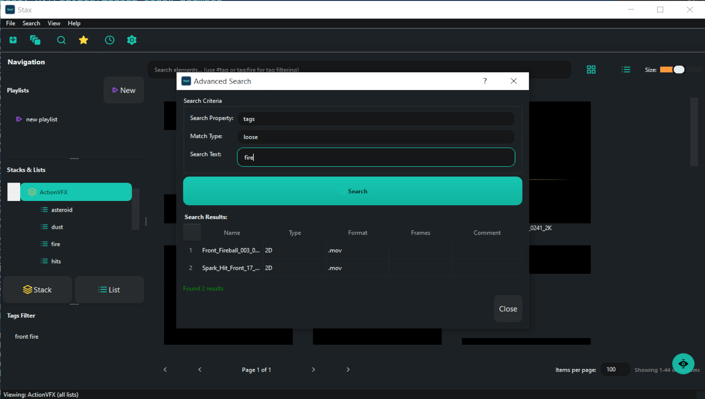

## How StaX Works


### Organization Hierarchy

StaX uses a three-level hierarchy to organize assets:

```
Stacks (Primary Categories)
  └─ Lists (Sub-Categories)
      └─ Sub-Lists (Optional nested categories)
          └─ Elements (Individual Assets)
```

**Example structure:**
```
📦 Plates
  └─ 🗂 Explosions
      └─ 🗂 Aerial Explosions
          └─ 🎬 explosion_aerial_001.mov
          └─ 🎬 explosion_aerial_002.mov
  └─ 🗂 Cityscapes
      └─ 🖼 NYC_skyline_####.exr (frames 1001-1150)

📦 3D Assets
  └─ 🗂 Characters
      └─ 🎨 hero_model.abc
  └─ 🗂 Props
      └─ 🎨 vehicle_rig.fbx
```

### Asset Ingestion

**Single File Ingestion:**
1. Go to **File → Ingest Files** (or press `Ctrl+I`)
2. Select files to ingest
3. Choose target Stack and List
4. Select copy policy (hard copy or soft copy)
5. StaX automatically:
   - Detects image sequences and frame ranges
   - Copies files to repository (if hard copy selected)
   - Generates thumbnail, GIF, and video previews
   - Extracts metadata (resolution, format, duration, etc.)
   - Creates database entry

**Library Ingestion (Bulk):**
1. Go to **File → Ingest Library** (or press `Ctrl+Shift+I`)
2. Select a root folder
3. StaX scans the folder structure and maps folders to Stacks/Lists
4. Preview the structure and configure options
5. Ingest entire library in one operation

### Copy Policies

- **Hard Copy**: Physical files are copied to the repository directory. Assets remain accessible even if original files move.
- **Soft Copy**: Only file path references are stored. Useful for large assets on network storage.

### Searching and Filtering



**Live Filter:**
- Type in the search box to instantly filter elements by name
- Use `#tagname` to search by tags (e.g., `#fire` or `#fire,explosion`)

**Advanced Search** (`Ctrl+F`):
- Search by property: name, format, type, comment, tags
- Choose match type: loose (partial match) or strict (exact match)
- Results displayed in sortable table

### Favorites and Playlists

- **Favorites**: Click the ⭐ button or right-click → "Add to Favorites" for quick access to frequently used assets
- **Playlists**: Create collaborative collections with **+ Playlist** button. Add multiple elements to playlists for organized workflows.

---
