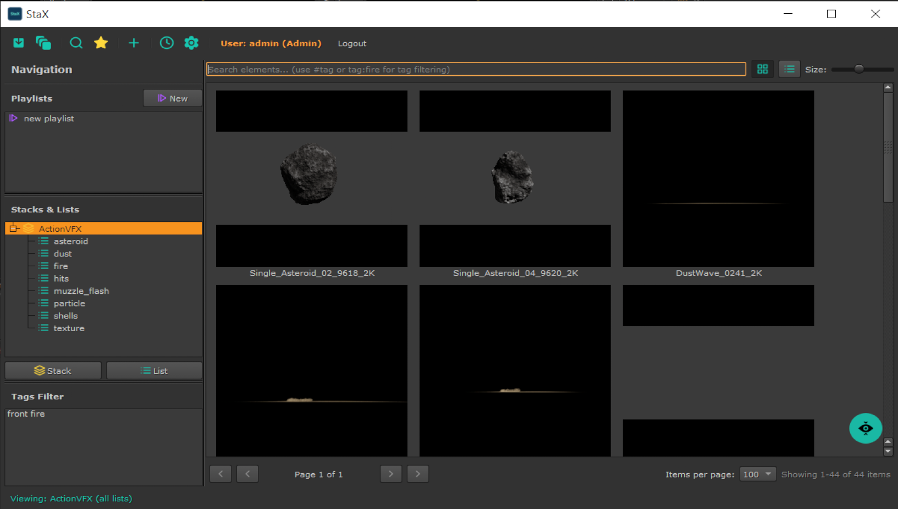

## Nuke Plugin Usage



### Opening StaX in Nuke

**Keyboard Shortcut:**
- Press `Ctrl+Alt+S` (Windows/Linux) or `Cmd+Alt+S` (macOS)

**Menu:**
- Navigate to **StaX → Open StaX Panel**

**Script Editor:**
```python
import nuke_launcher
nuke_launcher.show_stax_panel()
```

### Inserting Assets into Nuke

**Method 1: Drag and Drop**
1. Select element(s) in the StaX panel
2. Drag them into the Node Graph
3. StaX automatically creates:
   - **Read nodes** for 2D images/sequences with correct frame ranges
   - **ReadGeo nodes** for 3D assets (.abc, .obj, .fbx)
   - **Node graphs** for toolsets (.nk files)

**Method 2: Double-Click**
- Double-click any element to insert it into the DAG at the current position

**Method 3: Insert Button**
- Hover over an element while holding `Alt` to show the Media Info Popup
- Click the **"Insert into Nuke"** button

### Registering Toolsets

Save your Nuke node setups as reusable assets:

1. Select nodes in the Node Graph
2. Press `Ctrl+Shift+T` or go to **StaX → Register Toolset**
3. Enter toolset name, select target list, add comment
4. Optional: Generate preview image of node graph
5. StaX saves the .nk file and catalogs it as an element

Toolsets can then be dragged back into any Nuke session.

### Quick Actions

Available in the **StaX** menu:

- **Quick Ingest** (`Ctrl+Shift+I`): Ingest files immediately without opening full dialog
- **Register Toolset** (`Ctrl+Shift+T`): Save selected nodes as toolset
- **Advanced Search** (`Ctrl+F`): Open advanced search dialog

---
