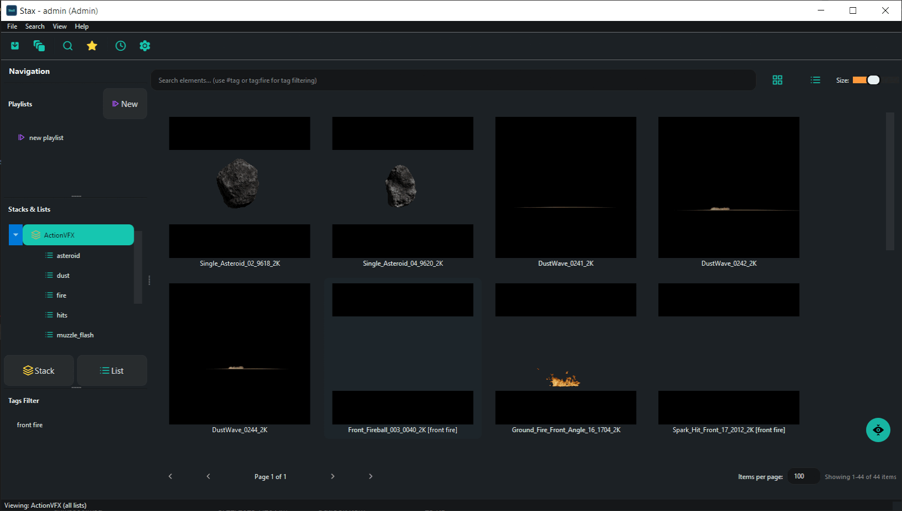
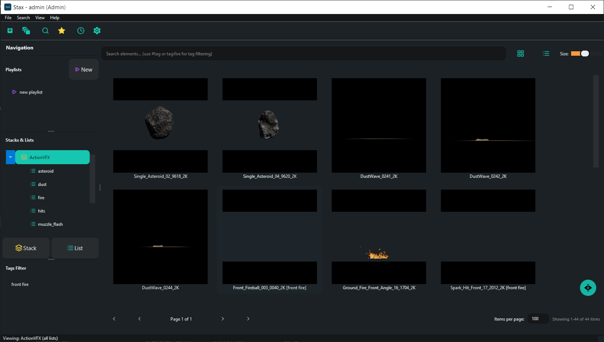

  

    <em>Professional stock footage and asset management system for VFX pipelines</em>

StaX is an advanced media browser and asset management tool designed specifically for integration with Foundry Nuke. It provides powerful features for organizing, searching, and deploying visual effects assets with intelligent sequence detection, automated preview generation, and extensible pipeline hooks.

---

## What is StaX?

StaX helps VFX artists and studios manage large collections of stock footage, 3D assets, and Nuke toolsets through:

- **Hierarchical Organization**: Organize assets into Stacks → Lists → Elements with support for nested sub-lists
- **Smart Ingestion**: Automatic image sequence detection, frame range discovery, and metadata extraction
- **Dual-Path Storage**: Choose between hard copies (physical repository) or soft copies (reference links)
- **Rich Previews**: Automatic thumbnail, GIF, and video preview generation for quick asset review
 - **Interactive 3D Preview**: Inspect geometry assets directly inside StaX with the built-in Scene Viewer. The viewer embeds a lightweight WebGL frontend (the bundled `js-3d-model-viewer`) to render `glb`/`gltf` payloads inside the preview pane. For non-GLB geometry sources StaX can convert assets to GLB using Blender (via the tracked `src/convert_to_glb.py` script) or attempt Python-library fallbacks so they can be inspected in the viewer.
- **Nuke Integration**: Drag and drop assets directly into Nuke's Node Graph with automatic Read/ReadGeo node creation
- **Network-Ready**: SQLite database with file locking for multi-user workstation access
- **Extensible**: Custom Python processors for pre-ingest validation, post-ingest hooks, and post-import node configuration

---

## Documentation

- **[documentation.md](documentation.md)**: An internal reference describing StaX features, installation, and usage.

---

## Project Status

**Current Phase:** Beta  
**Python Version:** 2.7 / 3.x (dual compatibility)  
**GUI Framework:** PySide2

**Completed Features:**
- ✅ Database layer with network-aware file locking
- ✅ Ingestion engine with sequence detection
- ✅ Nuke integration (standalone and plugin modes)
- ✅ Extensibility hooks (custom processors)
- ✅ Complete GUI with gallery/list views
- ✅ Preview generation (thumbnails, GIFs, videos)
- ✅ User/permission management
- ✅ Favorites and playlists
- ✅ Advanced search and filtering
- ✅ Drag & drop to Nuke DAG
- ✅ Toolset registration

See [Roadmap.md](Roadmap.md) for planned features and [changelog.md](changelog.md) for recent updates.

---

## Contributing

StaX is under active development. Contributions, bug reports, and feature requests are welcome through GitHub Issues and Pull Requests.

## License

Copyright (c) 2025 Ahmed Ramadan

This project is provided for non-commercial use under the following terms:

- You are free to use, modify, and distribute the software for personal, educational, or non-commercial research and development purposes.
- Commercial use (including distribution, sale, or incorporation into a commercial product or service) is NOT permitted without prior written permission from the copyright holder.

To request commercial licensing or permission, contact the author at the address listed in the project metadata or open an issue on the repository describing your intended commercial use.

If you require a standard open-source license instead (MIT, Apache, GPL, etc.), please contact the maintainer to discuss relicensing options.
